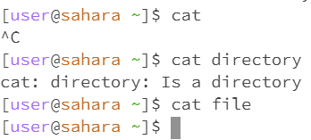

When you use `cd` by itself (no arguments), it does nothing. This is because you have not prompted the computer to change into what directory you wanted to go into. This defaults to the same directory that you are in now, meaning you are still in the home directory and have not generated an error from the command. If you were to use the `cd` command to eneter into the directory "directory", and use `cd` again with no arguments, then you would simply change into the home directory.

When using `cd` with a directory as the argument, you are changing into the directory that you chose. In this example, I changed from the home directory to the "directory" directory. This is correct and did not result in an error.

Now that I'm in the "directory" directory, I am using the `cd` command with the argument of a file. This would result in an error because you cannot change directories into somehting that is not a directory.

when using `ls` with no arguments, you are looking and what's in the current directory. As we are in the home directory, it prints out the directory named "directory" and our file named "file" as the file and directory is in our home directory. In this instance, I am in the home directory and the command did not result in an error. If we were to enter into the "file" file and use the `ls` command, we would find that it prints nothing as there is nothing under the file. 

When using `ls` with a directory as an argument, the termminal prints nothing. This is due to the fact that `ls` lists the files under a directory. Meaning when I had no files under the directory "directory", the command printed nothing. I am still in the home directory and the command did not result in an error.

When using `ls` with a file as an argument, the terminal simply printed the name of the file. This just happens and `ls` is supposed to print the names of the file, which in this case, is "file". When using `ls`, you do not change directories so you are still in the home directory. Again, the command did what it was supposed to and did not result in an error.

Using `cat` with no argument allows users to print any input coming from the keyboard. As such, I used control c to end the command and return to my directory (which is the home directory). This would not result in an error.

When using `cat` with a directory as an argument, it would print that the directory in the argument "is a directory" which wouldn't result in an error. The reason being is that the directory exists already. When this happened, I am still in the home directory.

When using `cat` with a file as an argument, the image shows nothing. This is because the file that I created in the example contains nothing. This is not an error and I did not change directories.
