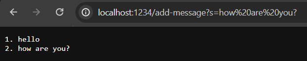
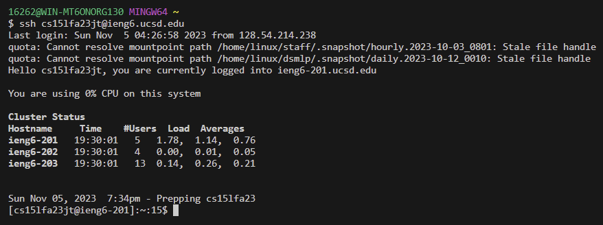

Part 1

* Which methods in your code are called?

* What are the relevant arguments to those methods, and the values of any relevant fields of the class?

* How do the values of any relevant fields of the class change from this specific request? If no values got changed, explain why.

* Which methods in your code are called?

* What are the relevant arguments to those methods, and the values of any relevant fields of the class?

* How do the values of any relevant fields of the class change from this specific request? If no values got changed, explain why.

Part 2

* The path to the private key for your SSH key for logging into ieng6 (on your computer or on the home directory of the lab computer).

* The path to the public key for your SSH key for logging into ieng6 (within your account on ieng6).

* A terminal interaction where you log into ieng6 with your course-specific account without being asked for a password.

Part 3

In a couple of sentences, describe something you learned from lab in week 2 or 3 that you didn’t know before.

Something that I've learned from lab in week 3 is that other people could log into your server. It didn't occur to me that servers were public and take when you log into the server, you could also make changes to the web through the url.
