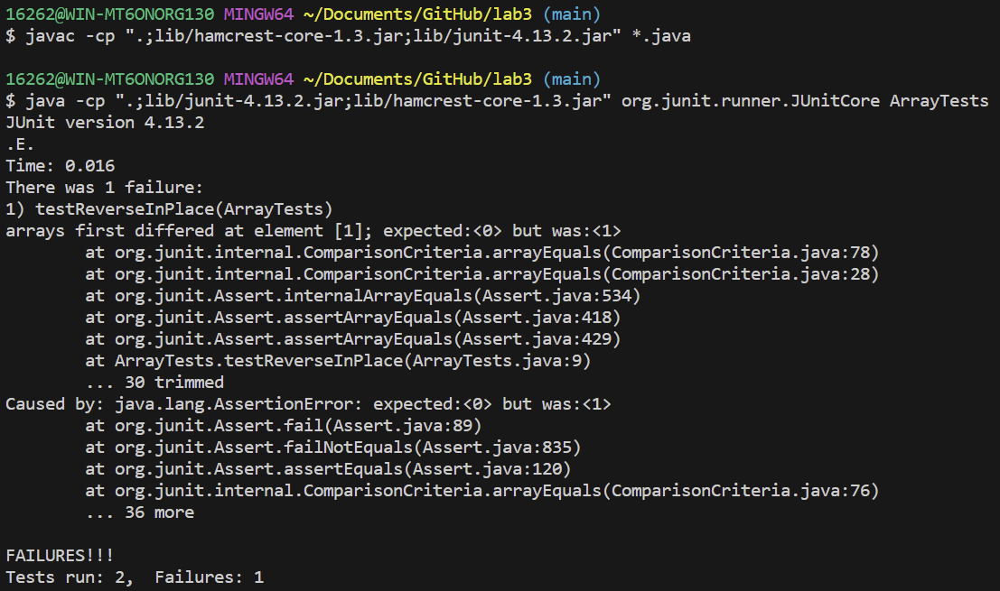
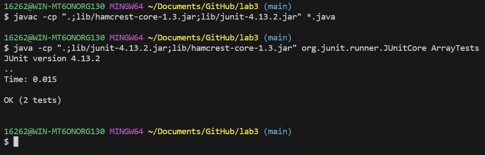

Lab Report 3 - Bugs and Commands (Week 5)

Part 1 - Bugs
Choose one of the bugs from week 4’s lab.

Provide:

* A failure-inducing input for the buggy program, as a JUnit test and any associated code (write it as a code block in Markdown)

```public class ArrayTests {
	@Test
	public void testReverseInPlace() {
 	int[] input1 = { 0,1 };
    int[] input1 = { 0,1 };
    ArrayExamples.reverseInPlace(input1);
    assertArrayEquals(new int[]{ 1, 0 }, input1);
	}
```

* An input that doesn’t induce a failure, as a JUnit test and any associated code (write it as a code block in Markdown)

```public class ArrayTests {
	@Test 
	public void testReverseInPlace() {
    int[] input1 = { 1,2,1 };
    ArrayExamples.reverseInPlace(input1);
    assertArrayEquals(new int[]{ 1,2,1 }, input1);
	}
```

* The symptom, as the output of running the tests (provide it as a screenshot of running JUnit with at least the two inputs above)

Sympton of input array [0,1]:



Sympton of input array [1,2,1]:



* The bug, as the before-and-after code change required to fix it (as two code blocks in Markdown)

Before:

```static void reverseInPlace(int[] arr) {
    for(int i = 0; i < arr.length; i += 1) {
      arr[i] = arr[arr.length - i - 1];
    }
  }
```

After: 

```static void reverseInPlace(int[] arr) {
    for(int i = 0; i < arr.length/2; i += 1) {
      int x = arr[i];
      arr[i] = arr[arr.length - i - 1];
      arr[arr.length - i - 1] = x;
    }
  }
```

* Briefly describe why the fix addresses the issue.

The fix solved the issue of repeating values for the latter half of the array. In the new code, the array length is split into two and each value that is replaced is stored in the value x. This ensures that the value can be assigned to the correct place during the for loop when i is incremented.

Part 2 - Researching Commands

grep -r

1. directory:

`grep -r "PLANES" 911report`
`911report/chapter-1.txt:"WE HAVE SOME PLANES"
911report/chapter-5.txt:            THE "PLANES OPERATION"`

The grep -r command recursively finds the pattern that you are looking for from the directory into the file and lists them as an absolute path. This is useful when you don't know which file it is in.

2. file:

`grep -r "PLANES" 911report/chapter-1.txt`
`"WE HAVE SOME PLANES"`

Using the same command on a file simply finds and prints the line with the pattern that you are looking for.

grep -n

3. directory:

`grep -n "PLANES" 911report`
`grep: 911report: Is a directory`

Using the grep -n command does not work on directories as it does not have number lines.

4. file:
`grep -n "PLANES" 911report/chapter-1.txt`
`4:"WE HAVE SOME PLANES"`

Using the command on a file with number lines finds the pattern and prints the line along with the number line. This is useful when you want to find the where the pattern exists in the file.

grep -o

5. directory:
`grep -o "PLANES" 911report`
`grep: 911report: Is a directory`

The grep -o command does not work on directories as it is only meant to search through files and prints the word rather than the line.

7. file:
`grep -o "PLANES" 911report/chapter-1.txt`
`PLANES`

As shown here, the command finds the pattern and prints the word from the file as the output. This is useful when you just want to know how often that specific pattern appears in the file.

grep -v

7. directory:
`grep -v "PLANES" 911report`
`grep: 911report: Is a directory`

Grep -v does not work on directories as it is intended to find everything but the pattern.

8. file:
`grep -v "PLANES" 911report/preface.txt`

   `PREFACE
            We present the narrative of this report and the recommendations that flow from it to
                the President of the United States, the United States Congress, and the American
                people for their consideration. Ten Commissioners-five Republicans and five
                Democrats chosen by elected leaders from our nation's capital at a time of great
                partisan division-have come together to present this report without dissent...`

In this example, using the "PLANES" under the file preface.txt printed the enitre file as there were no words that were specifically "PLANES". This is useful if you want to filter through words in a file.

https://man7.org/linux/man-pages/man1/grep.1.html
