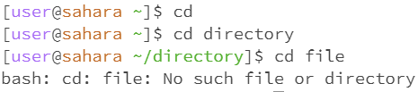

Lab Report 4 - Vim (Week 7)

1. Log into ieng6

Keys pressed: ssh cs15lfa23jt@ieng6.ucsd.edu <Enter>

Explaination: The commands allow you to log in remotely to the cse server using your ucsd user credentials. From here, you only need to press enter since your 

2. Clone your fork of the repository from your Github account (using the SSH URL)

Keys pressed: git clone https://github.com/khuyenlai/lab7.git <Enter>

Explaination: 

3. Run the tests, demonstrating that they fail

Keys pressed: cd lab7, bash test.sh, <Enter>

Explaination: 

4. Edit the code file to fix the failing test

Keys pressed: vim ListExamples.java, 43J, 1E, x, i, 2, <Esc>, :wq, <Enter>

Explaination: 

5. Run the tests, demonstrating that they now succeed

Keys pressed: <up><up><Enter>

Explaination: 

6. Commit and push the resulting change to your Github account (you can pick any commit message!)

Keys pressed: 

Explaination: 
