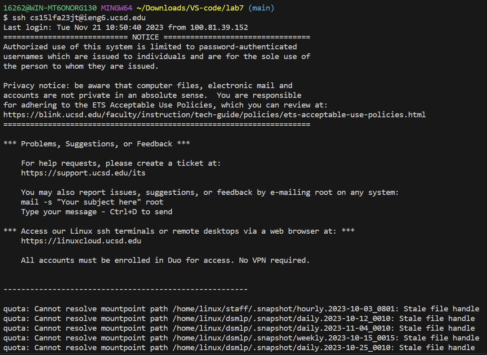
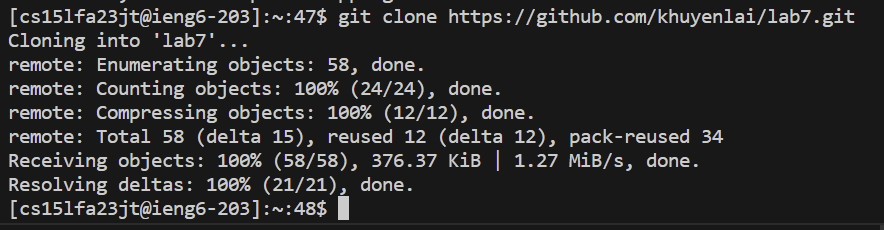
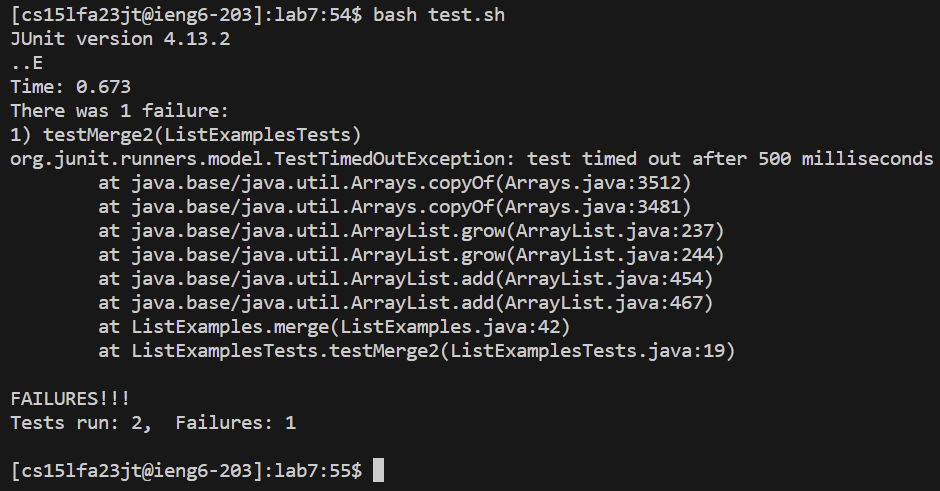
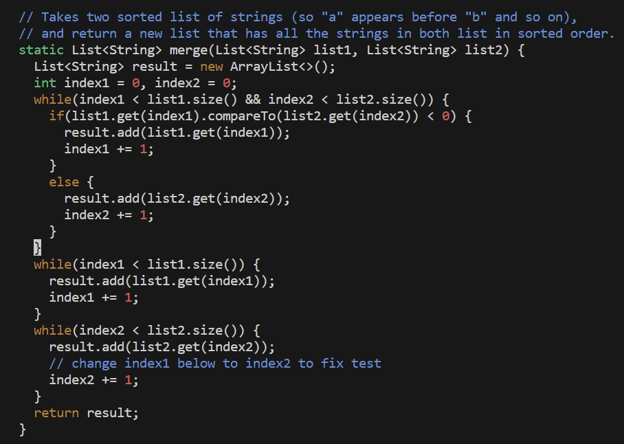
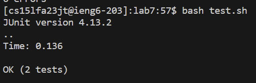
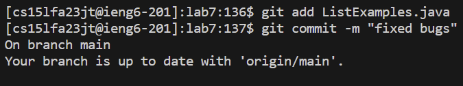
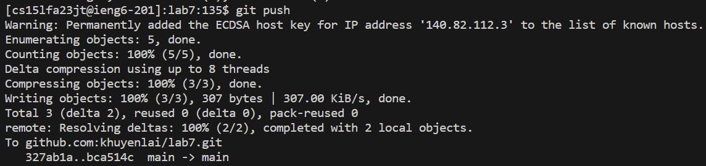

Lab Report 4 - Vim (Week 7)

1. Log into ieng6

Keys pressed: ssh cs15lfa23jt@ieng6.ucsd.edu `<Enter>`

Explaination: The commands allow you to log in remotely to the cse server using your ucsd user credentials. From here, you only need to press enter since you've already completed the steps with key-gen. 

2. Clone your fork of the repository from your Github account (using the SSH URL)

Keys pressed: git clone https://github.com/khuyenlai/lab7.git `<Enter>`

Explaination: To clone your fork of the repository, you use the `git clone` command along with the ssh github link on your github account and press <Enter>.

3. Run the tests, demonstrating that they fail

Keys pressed: cd lab7, `<Enter>`, bash test.sh, `<Enter>`

Explaination: To run the test, you have to be in the lab 7 directory and enter the `bash` command on the bash script test.sh. This script includes the commands to compile and run the tests needed for the student submissions. Finally, you press enter to complete the steps.

4. Edit the code file to fix the failing test

Keys pressed: vim ListExamples.java, `<Enter>`, 43J, 1E, x, i, 2, `<Esc>`, :wq, `<Enter>`

Explaination: You use the `vim` command with the name of the file that you want to view and edit in order to fix the code. You press <Enter> which allows you to see what is inside the file. Pressing 43J and 1E allows you to jump to the exact spot where you need to press `x` in order to delete the number 2. You then have to press <Esc> in order to escape from the inserting mode. Pressing `:wq` and <Enter> allows you to save and quit from VIM. 

5. Run the tests, demonstrating that they now succeed

Keys pressed: `<up><up><Enter>`

Explaination: To run the tests again, you simply press the <up> keys two times to return to the last two commands, AKA the `bash test.sh` command that we used earlier. 

6. Commit and push the resulting change to your Github account (you can pick any commit message!)

Keys pressed: git add ListExamples.java `<Enter>`, git commit -m "fixed bugs" `<Enter>`, git push `<Enter>` 

Explaination: Using the commands, `git add` along with the file name, stages the file to be committed in the future. Using the command, `git commit`, saves the chnages. Finally `push` "pushes" the changes to the github account.
