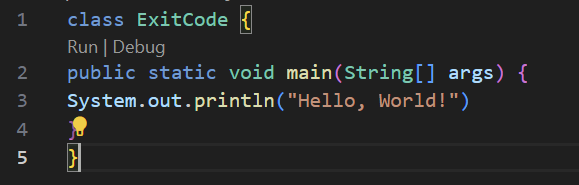
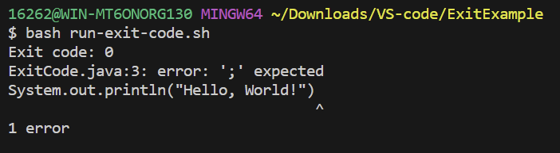
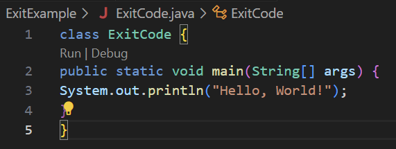
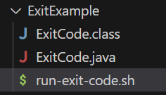
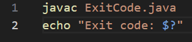

# Lab Report 5 - Putting it All Together (Week 9)
## Part 1 – Debugging Scenario

**Original Post from Student:**

Title: Weird Compilation Status Check
Category: Skill Demonstrations 

Description:
Hi, I'm practicing for skill demo 3 and I'm stuck on step 4. I'm trying to check the compilation status of my program, however, the value is always 0 even when there are compilation errors. 

Here's what happened when there was an error: 

This was the ouput: 

And here's the same code with no errors:

With the following output: 

I've tried different scenarios with compilaiton success and compilation failure.

This is my code structure by the way: 

**Response from TA:**

Hey there! It looks like you're trying to check the compilation status using echo $?. However, keep in mind that using echo $? immediately after the compilation command might not give you the expected result. Instead, you should check the value of $? without echoing it.

Try this:

Let me know if this resolves the issue and gives you the correct compilation status!

## Part 2 – Reflection
