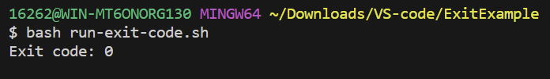

# Lab Report 5 - Putting it All Together (Week 9)
## Part 1 – Debugging Scenario

**Original Post from Student:**

Title: Weird Compilation Status Check

Category: Skill Demonstrations 

Description:
Hi, I'm practicing for skill demo 3 and I had a question about exit codes. I have a simple program that checks the compilation status of the main function, but the value is always 0 even when there are compilation errors. 

Here's the program with the error: 

This was the ouput: 

And here's the same code with no errors:

With the following output: 

This was my code structure by the way: 

And this was my bash script:

**Response from TA:**

Hey there! It looks like you're trying to check the compilation status using echo <code>$?</code>. However, you should keep in mind that you using echo <code>$?</code> before compiling it, will only echo the default value of the exit code (which is 0). Instead, you should check the value of <code>$?</code> after compilation like so:

Let me know if this works for you!

Response from student:

It looks like it works! The exit code shows 1 now that there's an error!

## Part 2 – Reflection
One cool thing that I learned that probably isn't that impressive is that I could remove files by navigating to my files direcotry on my computer, like literally pressing the files icon and deleting it from there. I had trouble with using the rm -rf command on the terminal and I almost had given up on removing the file when a friend reminded me I could just do it from the files icon on my screen lol.
